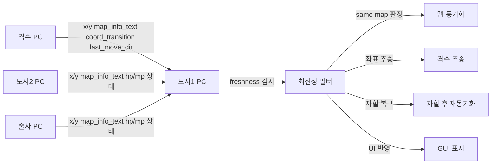

# 도사1 허브 구조 작업순서표

작성일: 2026-08-01  
목표: 도사1 PC를 중앙 허브로 두고, 격수/도사2/술사 PC가 UDP로 상태를 송신하며, 각 PC의 맵 이름·좌표·상태를 교환하고 동기화하는 구조로 개편한다.

---

## 1. 최종 목표

- 도사1 PC가 중앙 허브가 된다.
- 나머지 PC는 도사1 PC로 상태를 송신한다.
- 각 PC는 자신의 역할에 맞는 로직만 수행한다.
- 도사1은 모든 PC의 상태를 비교하여 같은 맵 여부와 추종 상태를 판단한다.
- 격수가 포탈 이동을 해도 도사1이 이를 빠르게 감지하고 추종을 유지한다.
- 자힐 이후에는 추종이 끊기지 않도록 상태 복구를 안정화한다.

---

## 2. 전체 설계 원칙

### 2.1 한 코드베이스, 4개 역할

- 파일을 4개로 분리하지 않는다.
- 공통 엔진은 하나로 유지한다.
- 실행 시 역할만 바꾼다.

역할:
- `도사1`
- `도사2`
- `격수`
- `술사`

### 2.2 도사1 중심 허브 방식

- 도사1만 전체 상태를 집계한다.
- 도사1은 수신한 데이터를 기준으로 모든 판단을 한다.
- 다른 PC는 도사1으로만 텔레메트리를 보낸다.

### 2.3 상태 판단 우선순위

1. 최신 수신 데이터
2. `map_info_text`
3. `map_info_change_seq`
4. `coord_transition`
5. `x/y`
6. `last_move_dir`

### 2.4 stale 데이터 배제

- 오래된 좌표는 follow 타깃에서 제외한다.
- 격수가 안 보이면 무조건 패트롤로 넘어가지 않도록 막는다.
- 마지막 유효 좌표는 짧은 시간만 유지한다.

---

## 3. 추천 구현 순서

### 3.1 1단계: 공통 스키마 확정

목표:
- 모든 PC가 동일한 필드 구조로 상태를 송신하게 만든다.

해야 할 일:
- `pc_id` 추가
- `role` 추가
- `map_info_text` 추가
- `map_info_change_seq` 추가
- `map_info_changed_at` 추가
- `coord_transition` 추가
- `coord_transition_seq` 추가
- `x/y` 추가
- `hp/mp` 추가
- `last_move_dir` 추가
- `red_tab_enabled` 추가
- `seq/ts` 추가

검토 포인트:
- 어떤 PC도 필드를 다르게 보내지 않게 한다.
- 도사1이 받는 데이터와 다른 PC가 보내는 데이터 형식을 일치시킨다.

---

### 3.2 2단계: 도사1 허브 고정

목표:
- 도사1이 전체 통합 상태를 보관한다.

해야 할 일:
- 도사1 실행 시 허브 모드 활성화
- 수신된 각 PC 상태를 `other_pc_data`에 저장
- GUI도 도사1 상태를 기준으로 표시

검토 포인트:
- 도사1이 아닌 PC는 허브 판단을 하지 않는다.
- 도사1만 다중 PC 비교를 수행한다.

---

### 3.3 3단계: 격수 송신 강화

대상 파일:
- `svc_warrior.py`
- 필요 시 `svc_monitor.py`

해야 할 일:
- 격수의 `map_info_text`를 안정적으로 송신
- `map_info_change_seq` 증가를 보장
- `coord_transition`을 빠르게 전송
- `last_move_dir`를 함께 전송

이 단계의 핵심:
- 포탈 직후 OCR이 잠깐 흔들려도 전송이 끊기면 안 된다.
- 좌표만 믿지 말고, 맵 변화 신호와 전환 시퀀스를 같이 보낸다.

검토 포인트:
- 격수가 맵 이동 시 `map_info_change_seq`가 상승하는가
- 격수 좌표가 짧게라도 바뀌지 않아도 `coord_transition` 또는 `map_info_text`로 변화가 보이는가

---

### 3.4 4단계: 도사1 수신 안정화

대상 파일:
- `bis_core.py`
- `bis_logic.py`

해야 할 일:
- 원격 데이터 freshness 검사
- stale 좌표 배제
- 역할별 최신 데이터 선택
- `map_info_text` 기준 맵 동일성 판정

필요한 규칙:
- 특정 시간 이상 지난 값은 follow 타깃으로 사용하지 않는다.
- 새 `map_info_change_seq`가 오면 즉시 재동기화 후보로 본다.
- `coord_transition`가 있으면 포탈 감지 우선순위를 올린다.

검토 포인트:
- 격수가 안 보일 때 도사가 옛 좌표를 붙잡지 않는가
- 동일 맵 판정이 UI와 로직 양쪽에서 일치하는가

---

### 3.5 5단계: 자힐 복구 후 재동기화

대상 파일:
- `bis_logic.py`

해야 할 일:
- 자힐 후 `ESC -> TAB -> TAB` 재진입을 안정화
- 이동 중 자힐 이후에도 추종이 이어지도록 한다
- 도사1이 follow 상태를 잃지 않도록 한다

핵심 규칙:
- 자힐 직후에는 stale follow 타깃을 버린다.
- 새 격수 스냅샷이 들어오면 다시 동기화한다.
- redtab이 안 잡히면 재시도한다.

검토 포인트:
- 자힐 후 도사가 격수의 옛 좌표를 맴돌지 않는가
- 자힐 후 UI와 내부 상태가 follow 재개를 반영하는가

---

### 3.6 6단계: 포탈 이동 실시간 감지

대상 파일:
- `svc_monitor.py`
- `bis_logic.py`
- `support_runtime_rules.py`

해야 할 일:
- `map_info` ROI 변화를 실시간 감지
- OCR이 흔들려도 변화 신호를 기록
- 좌표 급변이 없어도 포탈 진입을 감지
- 포탈 진입 방향과 접근 칸을 함께 관리

핵심 규칙:
- 포탈 진입은 `x/y` 단독이 아니라 `map_info_change_seq` + `coord_transition` + `last_move_dir` 조합으로 본다.
- 포탈 칸이 달라져도 공통 규칙으로 따라간다.

검토 포인트:
- 짧은 좌표 변화만으로 놓치는지 확인
- 맵 전환 후에도 포탈 진입이 늦지 않게 처리되는지 확인

---

### 3.7 7단계: GUI 동기화 표시

대상 파일:
- `gui_app.py`

해야 할 일:
- 각 PC의 `map_info_text` 표시
- 각 PC의 최신 수신 시각 표시
- 동일 맵 여부 표시
- 도사1 기준 전체 비교 표시

표시 예시:
- `MAPSYNC: SAME`
- `MAPSYNC: DIFF`
- `sync=ALL SAME`
- `sync=DIFF 격수:선비족입구`

검토 포인트:
- 운영자가 한눈에 상태를 이해할 수 있어야 한다.
- 역할별 화면 차이를 명확히 보여야 한다.

---

## 4. 파일별 작업 내용

### 4.1 `bis_core.py`

역할:
- 공통 상태 저장
- 원격 수신 저장
- payload 스키마 제공

작업:
- `map_info_text` 추가
- `map_info_change_seq` 추가
- `map_info_changed_at` 추가
- `map_info_changed` 추가
- 원격 데이터 freshness 필터 추가
- 역할별 최신 스냅샷 선택 개선

---

### 4.2 `svc_monitor.py`

역할:
- ROI OCR
- `map_info` 변화 감지

작업:
- `map_info` ROI를 OCR한다
- `map_info_signature` 생성
- `map_info_change_seq` 누적
- `map_info_changed` 갱신
- OCR 실패에도 변화 신호가 남도록 한다

---

### 4.3 `svc_warrior.py`

역할:
- 격수 상태 송신
- 격수 이벤트 신호 생성

작업:
- `map_info_text` 송신
- `coord_transition` 송신
- `last_move_dir` 송신
- 포탈 이동 직후 시퀀스 누락 방지

주의:
- 이 파일은 반드시 같이 수정하는 편이 맞다.
- 도사1이 받는 핵심 정보의 원천이 격수이기 때문이다.

---

### 4.4 `bis_logic.py`

역할:
- 도사1 중심 판단
- 추종
- 자힐 복구
- 포탈 진입

작업:
- stale remote data 차단
- 격수 맵 전환 감지
- 포탈 진입 재동기화
- 자힐 후 follow 재개
- 패트롤로 잘못 빠지는 경로 차단

---

### 4.5 `gui_app.py`

역할:
- 도사1 화면 표시
- 다중 PC 상태 비교 UI

작업:
- `map_info_text` 우선 표시
- PC별 맵 이름 표시
- 동일 맵 여부 표시
- 최신 수신 여부 표시

---

## 5. 데이터 흐름도

---

## 6. 수정 우선순위

### 우선순위 1
- `svc_warrior.py`
- `bis_core.py`
- `bis_logic.py`

이유:
- 현재 문제는 격수 정보가 도사1에 늦게 오거나 stale하게 쓰이는 점이 핵심이다.

### 우선순위 2
- `svc_monitor.py`

이유:
- `map_info` 변화 감지가 늦으면 포탈/맵 전환이 늦어진다.

### 우선순위 3
- `gui_app.py`

이유:
- 동작이 맞는지 사람이 바로 보려면 시각화가 필요하다.

---

## 7. 단계별 완료 기준

### 7.1 완료 기준 1
- 격수의 `map_info_text`가 도사1에 전달된다.
- 도사1이 최신 격수 좌표를 받는다.
- stale 좌표가 follow 타깃에 안 들어간다.

### 7.2 완료 기준 2
- 포탈 이동 시 `coord_transition` 또는 `map_info_change_seq`로 감지된다.
- 좌표 변화가 작아도 포탈 감지가 된다.

### 7.3 완료 기준 3
- 자힐 후 도사가 즉시 옛 좌표를 맴돌지 않는다.
- follow가 복구되고 재동기화된다.

### 7.4 완료 기준 4
- GUI에서 각 PC의 맵 이름과 동일 맵 여부를 확인할 수 있다.

---

## 8. 실제 적용 시 주의사항

- 역할별 파일 분리는 마지막 수단으로 남긴다.
- 먼저 공통 스키마를 맞춰야 한다.
- 텔레메트리 수신보다 오래된 값은 사용하지 않는다.
- 포탈과 맵 이동은 좌표 하나만으로 판정하지 않는다.
- 자힐 후에는 항상 follow 상태를 재점검한다.

---

## 9. 추천 실행 순서

1. `bis_core.py`에 공통 payload 스키마 확정
2. `svc_warrior.py`에서 격수 송신 강화
3. `svc_monitor.py`에서 `map_info` 변화 감지 강화
4. `bis_logic.py`에서 stale 데이터 차단과 재동기화 수정
5. `gui_app.py`에서 동일 맵/최신성 표시 추가
6. 각 PC에서 4모드 실행 후 실사용 검증

---

## 10. 결론

- 최종 구조는 `도사1 허브 + 3대 PC 텔레메트리`가 맞다.
- `svc_warrior`는 같이 수정해야 한다.
- 4개 캐릭터는 역할 모드로 분리하되, 코드는 하나의 공통 엔진으로 유지하는 것이 가장 안정적이다.
- 핵심은 `map_info_text`, `map_info_change_seq`, `coord_transition`, `freshness` 네 가지를 함께 쓰는 것이다.
